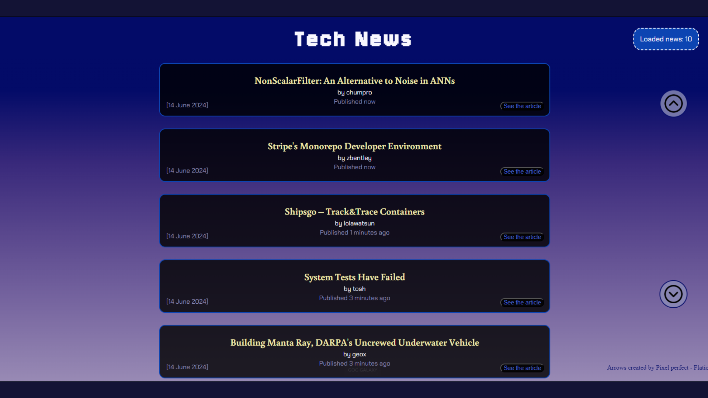

<!-- Improved compatibility of back to top link: See: https://github.com/othneildrew/Best-README-Template/pull/73 -->

<!--
*** Thanks for checking out the Best-README-Template. If you have a suggestion
*** that would make this better, please fork the repo and create a pull request
*** or simply open an issue with the tag "enhancement".
*** Don't forget to give the project a star!
*** Thanks again! Now go create something AMAZING! :D
-->

<!-- PROJECT SHIELDS -->
<!--
*** I'm using markdown "reference style" links for readability.
*** Reference links are enclosed in brackets [ ] instead of parentheses ( ).
*** See the bottom of this document for the declaration of the reference variables
*** for contributors-url, forks-url, etc. This is an optional, concise syntax you may use.
*** https://www.markdownguide.org/basic-syntax/#reference-style-links
-->

<!-- PROJECT LOGO -->
 

  

<h3 align="center">Tech News</h3>

[For the site, click here!](https://lonneww.github.io/technews/)

  

    This project is the pratical exam of the Javascript Advanced <a href="https://www.start2impact.it"> start2impact University's </a> course.  
    The task was to create a web application to democratize the spread of information in the tech field through the use of the <a href="https://github.com/HackerNews/API">Hacker News API</a> service.
  

<!-- TABLE OF CONTENTS -->

  
Table of Contents

  <ol>
    <li>
      <a href="#about-the-project">About The Project</a>
      <ul>
        <li><a href="#built-with">Built With</a></li>
      </ul>
    </li>
    <li><a href="#usage">Usage</a></li>
    <li><a href="#flaws">Flaws</a></li>
    <li><a href="#license">License</a></li>
    <li><a href="#contact">Contact</a></li>
    <li><a href="#feedbacks">Feedbacks</a></li>
  </ol>

<!-- ABOUT THE PROJECT -->

## About The Project

(<a href="#readme-top">back to top</a>)

### Built With

- [![HTML5][html-badge]][html-url]
- [![CSS][css-badge]][css-url]
- [![SASS][sass-badge]][sass-url]
- [![JS][js-badge]][js-url]
- [![WEBPACK][webpack-badge]][webpack-url]

 

(<a href="#readme-top">back to top</a>)

<!-- USAGE EXAMPLES -->

## Usage

Let’s start with the visual content.  
The news is structured like this:  
Each item has a title; an author; if included, a description; the date of publication of the article; the time passed since the publication; and a button that takes you to the article itself.  
In the upper-right corner of the page, you can see how many news items are currently loaded. 
On the right side, there are two navigation buttons: the upper one takes you to the top, the other to the bottom of the page.  
Below all the loaded news, there’s a “load more” button that, when clicked, loads and displays up to 10 more news items.  
The app can load, at most, a total of 500 news items simultaneously.  
To see more recent news, you’ll need to reload the page.

(<a href="#readme-top">back to top</a>)

<!-- FLAWS -->

## Flaws

A little list of the site's flaws:

1. The layout is not responsive on all mobile/tablet devices. It’s usable and effective, but not efficient.
2. Some news, after being fetched, might lack some important information, like the article URL. In the current state of the website, these news items are simply skipped. It could be a good idea to push the IDs of the “incorrect” news to the end of the IDs array, to re-fetch their information at a later time.
3. Since news items are constantly being uploaded (and it’s easy to miss some), it might be a good idea to implement a system that saves the news in a “to read later” page, or to filter the news to load by subject.

(<a href="#readme-top">back to top</a>)

<!-- LICENSE -->

## License

Distributed under the MIT License. See `LICENSE.txt` for more information.

(<a href="#readme-top">back to top</a>)

<!-- CONTACT -->

## Contact

- [![Website Portfolio][site-badge]][site-url]
- [![LinkedIn][linkedin-shield]][linkedin-url]
- [![Instagram][instagram-shield]][instagram-url]

(<a href="#readme-top">back to top</a>)

<!-- FEEDBACKS -->

## Feedbacks

So, this is it, hope you liked the project.  
If you'd like to spend some of your time to tell me what you think about it or maybe give me some hints to how you would optimize things, I'll be very, very grateful.

(<a href="#readme-top">back to top</a>)

[html-badge]: https://img.shields.io/badge/HTML-grey?style=flat&logo=html5&logoColor=%23E34F26
[html-url]: https://html.it
[css-badge]: https://img.shields.io/badge/CSS-grey?style=flat&logo=css3&logoColor=%231572B6
[css-url]: https://www.w3schools.com/css/
[sass-badge]: https://img.shields.io/badge/SASS-grey?style=flat&logo=sass&logoColor=%23CC6699
[sass-url]: https://sass-lang.com
[js-badge]: https://img.shields.io/badge/Javascript-grey?style=flat&logo=javascript&logoColor=%23F7DF1E
[js-url]: https://www.w3schools.com/js/
[webpack-badge]: https://img.shields.io/badge/Webpack?style=flat&logo=webpack&logoColor=%238DD6F9
[webpack-url]: https://webpack.js.org
[site-badge]: https://img.shields.io/badge/Website-grey?style=flat
[site-url]: https://lonneww.github.io/portfolio/
[instagram-shield]: https://img.shields.io/badge/Instagram-grey?style=flat&logo=instagram&logoColor=%23E4405F
[instagram-url]: https://instagram.com/samuelbaz?igshid=MzNlNGNkZWQ4Mg==
[linkedin-shield]: https://img.shields.io/badge/Linkedin-grey?style=flat&logo=linkedin&logoColor=%230A66C2
[linkedin-url]: https://www.linkedin.com/in/samuel-barbieri-100886208/
